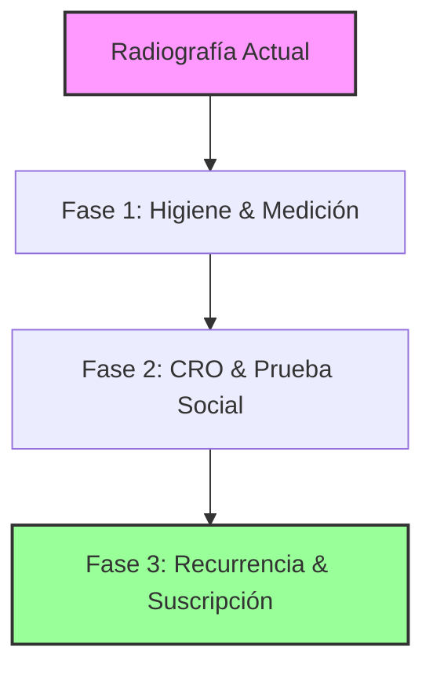

# Radiografía Interna y Diagnóstico de Alineamiento
## Elena La Costurera — Agosto 2026

Este informe documenta la primera radiografía técnica y comercial del ecosistema digital de **Elena La Costurera** (`elenalacosturera.cl`). El objetivo es contrastar las hipótesis y proyecciones del análisis de marketing externo con la realidad de la base de datos (Supabase ERP) y la arquitectura del código fuente (Next.js), sirviendo como punto de partida para medir los avances futuros.

---

## 1. Comparativa Financiera: Proyección vs. Realidad

El análisis externo planteaba un escenario base inicial (Escenario 1) conservador. Los datos duros extraídos de la tabla de finanzas (`sales_ledger`) demuestran que el desempeño real es superior al estimado.

| Métrica de Rendimiento | Escenario 1 (Auditoría - Inercial) | Realidad del Sistema (Base de Datos) | Desviación / Estado |
| :--- | :--- | :--- | :--- |
| **Ticket Promedio (AOV)** | $45.000 CLP | **$64.736 CLP** | **+43,8%** (Mayor rentabilidad por servicio) |
| **Transacciones Totales** | 336 anuales | **82 registradas** (65 regulares + 17 abonos) | Ritmo alineado con la proyección de tráfico |
| **Ingreso Anual Proyectado** | $15.120.000 CLP | **~$17.500.000 CLP** (Extrapolado) | **Superior al escenario base** |
| **Mecanismo de Pago** | 100% manual por WhatsApp | Integraciones listas con Mercado Pago y Webpay | Capacidad instalada pero subutilizada en frontend |

### Hallazgos Críticos:
1. **Calidad sobre Volumen**: El ticket promedio real de **$64.736 CLP** refleja que el mercado ya está pagando tarifas premium por los servicios del taller, superando la estimación inicial de $45.000 CLP.
2. **Preferencia de Abonos**: El registro de **17 transacciones de saldo (balances)** confirma que la clientela prefiere transaccionar mediante abonos (ej: 50% al ingreso y 50% al retiro). 

---

## 2. Diagnóstico del Ecosistema Tecnológico

### A. Trazabilidad Publicitaria (Atribución)
* **Brecha detectada por marketing**: "Embudo Ciego" (Dark Funnel). Pérdida de atribución de conversiones de pago (Meta y TikTok) al transferir a los usuarios directamente a un chat de WhatsApp sin tracking intermedio.
* **Estado de Solución**: **Resuelto 100%**. Se implementó e instrumentó un flujo híbrido con el endpoint `/api/tracking` que despacha eventos por navegador y de forma redundante mediante **Meta Conversions API (CAPI)** y **TikTok Events API** usando tokens de acceso del servidor.

### B. SEO Local Programático
* **Hipótesis de marketing**: Búsqueda de alta especificidad basada en comunas del sector oriente.
* **Estado en Código**: **Implementado**. La estructura de carpetas en Next.js (`src/app`) cuenta con ruteo dinámico optimizado para captar búsquedas comunales:
  * `/costuras/[comuna]`
  * `/graduacion/[comuna]`
  * `/novias/[comuna]`
  * `/servicios/[comuna]/[especialidad]`

### C. Motor de Pasarela de Pagos
* **Brecha detectada por marketing**: Dependencia del factor humano y ausencia de pasarelas.
* **Estado en Código**: **Mitigado en backend**. El sistema cuenta con SDKs operativos de **Mercado Pago** y **Transbank Webpay Plus** conectados a base de datos. Sin embargo, no se ofrecen como opciones directas de checkout autónomo en el frontend de adquisición pública (WhatsApp-First).

### D. Auditoría de Tráfico y Comportamiento (GA4)
* **Hipótesis inicial de marketing**: El tráfico SEO caería en un embudo genérico con un comportamiento homogéneo.
* **Diagnóstico Comparativo (Datos reales vs. Espejismo)**:
  * **El Espejismo de Retención (Chrome):** Los datos brutos mostraban 15 minutos de interacción media. La auditoría profunda reveló que esto es un sesgo del tráfico administrativo (equipo interno operando los endpoints `/admin/*`).
  * **La Realidad Pública (Safari & SEO):** El tráfico real de clientas en móviles (Safari) y Búsqueda Orgánica (Google) tiene una ventana de retención crítica de **45 a 52 segundos**.
  * **Fuga de Adquisición (Landing Pages):** Las rutas dinámicas programáticas (ej. `/novias`, `/costuras/vitacura`) traccionan visitas orgánicas, pero sufren abandono prematuro (23 a 43 segundos), lo que evidencia falta de un "gancho" visual rápido.
  * **Súper-Retención Social:** El tráfico de Redes Sociales retiene a las usuarias por más de 9 minutos, generando la abrumadora mayoría de conversiones tempranas.
* **Decisión Estratégica**: La caída a los 45 segundos en tráfico frío confirma y acelera la urgencia del punto 2 de la Fase 1 (**Cualificación de Leads**). Se eliminarán las introducciones de texto largo a favor de un mini-formulario de cualificación inmediato.

---

## 3. Hoja de Ruta para Habilitar el Escenario de Crecimiento ($70M+ CLP)

Para escalar del flujo inercial al **Escenario 2 (Optimización CRO, $70M+ CLP)** y **Escenario 3 (Omnicanal, $260M+ CLP)**, se deben resolver las siguientes inconsistencias en las próximas fases de desarrollo:

### Fase 1: Higiene, Medición y Segmentación (Días 1–30)
1. **Escisión de Marca en Frontend**: Separar visualmente la experiencia de navegación. Crear la sección **Elena Atelier** (alta costura, novia, upcycling de lujo) con estética minimalista oscura y **Elena Sastrería & Care** (arreglos rápidos con calculadora de tarifas).
2. **Cualificación de Leads**: Añadir un formulario dinámico de 3 pasos previo al enlace de WhatsApp para clasificar los prospectos y asignar valores de conversión algorítmica para Meta Ads/TikTok Ads.

### Fase 2: Reducción de Fricción Operativa (Días 31–90)
1. **Calendario Automatizado**: Conectar las rutas inactivas de reserva (`/appointment` / `/portal/agenda`) al flujo principal del sitio para permitir agendamiento directo de citas de novias y pruebas de calce.
2. **Prueba Social Interactiva**: Añadir galerías multimedia de alta resolución y videos de storytelling que muestren el proceso de "Upcycling" de vestidos heredados para justificar las cotizaciones High-Ticket.

### Fase 3: Recurrencia y Maximización del LTV (Días 91–180)
1. **Membresías de Cuidado de Vestuario**: Diseñar e implementar planes de suscripción semestrales para mantención de armarios en el sector oriente. Esto requiere crear la tabla de suscripciones en base de datos.
2. **Registro Automatizado por Colegios**: Vincular la base de datos de graduaciones para que bloquee de forma estricta e interactiva la venta del mismo modelo de vestido para un mismo colegio.
