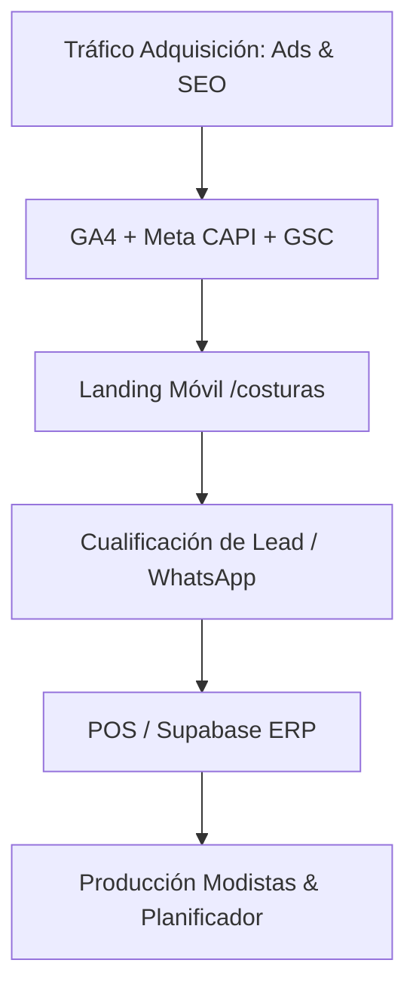

# 🛠️ Ecosistema de Analítica y Estrategia de Usabilidad — Elena Atelier

Este documento consolida la arquitectura completa de herramientas de analítica, monitoreo y optimización conectadas a **Elena Atelier** (`elenalacosturera.cl`), detallando sus credenciales locales y las estrategias clave de usabilidad implementadas para el sistema.

---

## 1. Matriz de Herramientas, Credenciales y Estado

| Herramienta | Identificador / Parámetro | Ubicación de Credenciales | Estado | Función Principal |
| :--- | :--- | :--- | :--- | :--- |
| **Google Analytics 4 (Data API)** | Property: `489116804` Measurement: `G-MFET871LBV` | `ga_key.json` `.env.local` (`NEXT_PUBLIC_GA_MEASUREMENT_ID`) | 🟢 Conectado | Medición de usuarios móviles, retenedores, demografía y eventos de conversión (`Schedule`, `Contact`). |
| **Google Search Console (GSC API)** | `https://www.elenalacosturera.cl/` Sitemap: `/sitemap.xml` | `ga_key.json` `.env.local` (`GA4_PROPERTY_ID`) | 🟢 Procesado | Auditoría de SEO programático, posición en Google, CTR por palabras clave de cola larga. |
| **Google Business Profile (Maps)** | Tabancura 1091, Of 319, Vitacura | `ga_key.json` `src/components/LocationMap.tsx` | 🟢 Conectado | Atribución de tráfico local, solicitudes de ruta GPS (Waze / Google Maps) y llamadas directas. |
| **Meta Pixel & Conversions API (CAPI)** | Pixel ID: `1058654093375662` | `.env.local` (`NEXT_PUBLIC_FACEBOOK_PIXEL_ID`, `FACEBOOK_ACCESS_TOKEN`) | 🟢 Conectado | Atribución redundante servidor-a-servidor para campañas en Instagram y Facebook Ads. |
| **TikTok Pixel & Events API** | Pixel ID: `D9V5UUJC77U31VPN3PIG` | `.env.local` (`NEXT_PUBLIC_TIKTOK_PIXEL_ID`, `TIKTOK_ACCESS_TOKEN`) | 🟢 Conectado | Rastreo de conversiones de video de graduaciones y tendencias de upcycling. |
| **Supabase ERP (Analítica Financiera)** | Proyecto: `tdzotbtoaserlrynhxum` | `.env.local` (`NEXT_PUBLIC_SUPABASE_URL`, `SUPABASE_SERVICE_ROLE_KEY`) | 🟢 Conectado | Auditoría de ventas, Ticket Promedio ($64.736 CLP), costo por hora modista y margen. |
| **Google AI Studio (Gemini API)** | Model: `gemini-2.5-flash` | `.env.local` (`GEMINI_API_KEY`) | 🟢 Conectado | Análisis visual inteligente de fotos de prendas enviadas por clientes para cotizar calce. |
| **OpenAI / DeepSeek API** | Engine: `sk-84c39df5...` | `.env.local` (`OPENAI_API_KEY`) | 🟢 Conectado | Motor de cualificación y asistente conversacional para canal de atención. |
| **Google Workspace Mail** | `elenaatalier@gmail.com` | `.env.local` (`SMTP_USER`, `SMTP_PASSWORD`) | 🟢 Conectado | Envío automatizado de comprobantes y confirmaciones de citas en el atelier. |
| **Mercado Pago & Webpay Plus** | Commerce: `597053082620` | `.env.local` (`MP_ACCESS_TOKEN`, `TBK_API_KEY`) | 🟢 Conectado | Procesamiento seguro de abonos (50%) y pagos completos en línea. |

---

## 2. Estrategias de Usabilidad y Optimización por Herramienta

### 📱 1. Estrategia Móvil Primero (GA4 & Meta Pixel)
* **Diagnóstico:** El 84,5% de las usuarias navega desde teléfonos inteligentes (Safari/Chrome Mobile) con una ventana de atención crítica de **45 a 52 segundos**.
* **Acción de Usabilidad:**
  - Reducción de menús y eliminación de tarjetas gigantes a favor de una **lista táctil ultracompacta de una sola línea**.
  - Destacado inicial del **Top 6 de Arreglos Más Solicitados** para permitir cotizar en 2 clics.
  - Botones CTA de WhatsApp en color cobre/bronce sutil (`#C17F5F`) alineados al diseño luxury.

### 🔍 2. Estrategia SEO & GEO para Motores de IA (Google Search Console & Schema.org)
* **Diagnóstico:** Búsquedas hiper-específicas de clientas en el Sector Oriente (*Vitacura, Las Condes, Lo Barnechea, La Dehesa*).
* **Acción de Usabilidad:**
  - **100% de Contenido HTML Visibles:** Sin pestañas u acordeones ocultos para que Google y modelos como ChatGPT/Gemini/Perplexity cataloguen los 141+ arreglos.
  - **Sitemap XML Sincronizado:** Automatizado en `/sitemap.xml` (procesado exitosamente por Google).
  - **Estructura JSON-LD:** Inyección de `Schema.org/Service` y `LocalBusiness` para atribución de cobertura geográfica.

### 🗺️ 3. Estrategia de Conversión Local (Google Maps & Waze)
* **Diagnóstico:** Clientas que requieren probarse prendas presencialmente en el atelier de Tabancura 1091, Oficina 319.
* **Acción de Usabilidad:**
  - Integración del mapa interactivo (`LocationMap.tsx`) con botones de un clic: **"Cómo Llegar en Google Maps"** y **"Navegar con Waze"**.
  - Notificaciones automáticas post-entrega para incentivar reseñas con fotos en Google Maps.

### 💰 4. Estrategia de Margen y Capacidad (Supabase ERP & POS)
* **Diagnóstico:** Necesidad de balancear la carga de trabajo de las modistas (máximo 8h/día).
* **Acción de Usabilidad:**
  - Sincronización automática de `production_time_minutes` desde la base de datos al carrito del POS (`/admin/pos`).
  - Panel administrativo (`/admin/catalog`) con interruptores instantáneos de visibilidad y botón de estrella (⭐) para fijar el Top 6 destacado.

---

## 3. Scripts de Consulta en Tiempo Real Disponibles

En la raíz del proyecto contamos con scripts automatizados ejecutables mediante consola:

1. **`node scratch_ga_demographics.js`**: Consulta en vivo a GA4 API de usuarios por dispositivo, páginas top y tiempo de permanencia.
2. **`node scratch_gsc_analytics.js`**: Consulta en vivo a Google Search Console API de estado del sitemap, impresiones y palabras clave.
3. **`node check_db.js`**: Consulta a la base de datos Supabase ERP para auditoría de servicios y caja.

---
*Documento actualizado en el repositorio local el 18 de Septiembre de 2026.*
