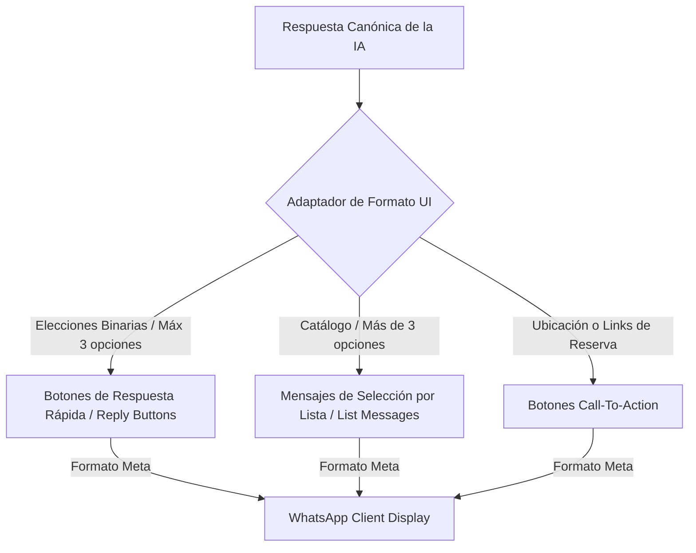
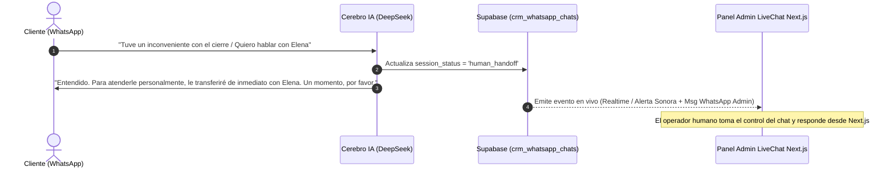

# MEMORIA MAESTRA Y PLAN DE TRABAJO: CEREBRO DE IA OMNICANAL PARA ELENA ATELIER

> **Estado del Documento:** Documento Vivo de Trabajo (Fase de Definición, Análisis y Alineación)  
> **Ubicación en Repositorio:** `memoria_maestra_plan_trabajo.md`  
> **Objetivo General:** Establecer la estructura técnica, operativa y de negocios para construir un Cerebro Conversacional Inteligente Multiplataforma (fase 1: WhatsApp Cloud API; preparado para Instagram, TikTok, WebChat y LinkedIn) impulsado por DeepSeek y Supabase ERP.

---

## 1. Visión General y Principios de Diseño

1. **Omnichannel-Ready por Diseño**:
   - Todo el sistema de mensajería se construye mediante un **Modelo Canónico de Mensajes (Agnóstico)**.
   - El motor de IA, las herramientas de agendamiento y la memoria no dependen de la red social de origen.
   - Sumar Instagram o TikTok en el futuro será una tarea de bajo esfuerzo mediante adaptadores aislados.

2. **Arquitectura Asíncrona Tolerante a Fallos**:
   - Ingesta rápida via Webhooks (respuesta HTTP 200 OK en <200ms a Meta para evitar bloqueos/reintentos).
   - Encolamiento de tareas en `ai_agent_tasks` en Supabase.
   - Procesamiento en segundo plano mediante un Worker Serverless y modelos de inferencia **DeepSeek (V4 Flash / V3 / R1)**.

3. **Cumplimiento Normativo y Ético**:
   - Alineado con exigencias de **SERNAC y Ley N° 21.719 en Chile** (Transparencia activa de IA, Minimización de datos y Protocolo ARCOP de privacidad).

---

## 2. DESGLOSE DETALLADO DE MÓDULOS DE TRABAJO

---

### 📌 MÓDULO 1: Identidad Conversacional, Nutrición por Chats Reales y Marco de Intenciones
*(Módulo 1 Completado)*

---

### 📌 MÓDULO 2: Base de Conocimientos Estructurada, Catálogo RAG y Matriz de Permisos
*(Módulo 2 Completado)*

---

### 📌 MÓDULO 3: Motor de Ventas, Agendamiento y Cierre Transaccional (Asesoría Gratuita & Conciliación)
*(Módulo 3 Completado)*

---

### 📌 MÓDULO 4: Arquitectura Técnica, DeepSeek API, Gemini Vision y Seguridad (Guardrails)
*(Módulo 4 Completado)*

---

### 📌 MÓDULO 5: Experiencia de Usuario UI/UX Interactivo y Human Handoff (LiveChat)

#### 5.1 Diseño de Componentes Interactivos de Meta WhatsApp
Para evitar la emisión de texto plano denso y acelerar la navegación táctil del cliente en pantallas móviles, el bot emite estructuras JSON que el Adaptador traduce a componentes gráficos estandarizados por Meta:

1. **Botones de Respuesta Rápida (Reply Buttons)**:
   - *Caso de Uso*: Opciones binarias o ternarias (ej. *"¿Prefiere cita el jueves o viernes?"* ➔ `[Ver Jueves 16:00]` `[Ver Viernes 10:00]`).
   - *Restricciones Meta*: Máximo **3 botones por mensaje**, títulos de máximo **20 caracteres**, sin markdown ni emojis en los títulos de botón.
2. **Mensajes de Selección por Lista (List Messages)**:
   - *Caso de Uso*: Selección de categorías de servicios o arreglos.
   - *Restricciones Meta*: Despliega un menú emergente inferior de **hasta 10 opciones** categorizadas.
3. **Botones Call-To-Action (CTA Buttons)**:
   - *Caso de Uso*: Botón directo *"Ver mi Reserva"* o *"Cómo llegar con Waze/Maps"*.

#### 5.2 Matriz de Notificaciones y Alertas al Equipo (Triggers & Canales)
* **Canales de Alerta**:
  1. **Push & Audio Web**: Notificación sonora y banner en tiempo real en la WebApp `/admin/livechat`.
  2. **WhatsApp Interno (Magic DeepLink)**: Notificación al número personal del Encargado/Admin con enlace directo de un clic para abrir la conversación en la WebApp sin fricción.
  3. **Escalamiento vía WhatsApp/Email**: Si un chat en estado `human_handoff` no se atiende en más de 10 minutos.

* **Puntos de Activación (Triggers)**:
  * 🟢 **Apertura de Chat**: Informativo en el dashboard web (silencioso, sin saturar al personal).
  * ⚠️ **Solicitud de Atencion Humana (Handoff)**: Mensaje por WhatsApp al encargado + Alerta sonora en el panel web.
  * 🚨 **Detección de Reclamo / Inconveniente**: Prioridad Alta. Pausa IA de inmediato y envía alerta urgente con extracto del problema.
  * 🎉 **Cita / Reserva Confirmada**: Notificación informativa con detalles del cliente y horario agendado.
  * ⏳ **Escalamiento (>10 min en espera)**: Si la costurera/encargado de turno no responde un chat derivado en 10 min, el sistema re-notifica al Administrador General.

#### 5.3 Mecanismo Técnico del Handoff

1. **Cambio de Estado Instantáneo**:
   - Supabase actualiza `crm_whatsapp_chats.session_status = 'human_handoff'`.
2. **Suspensión Autónoma del Bot**:
   - Mientras el estado sea `human_handoff`, el trigger de la base de datos inhabilita el envío de tareas a DeepSeek, evitando que la IA interrumpa la conversación del operador humano.
3. **Interruptor Manual de Reactivación (Toggle Button)**:
   - En el panel de LiveChat (`src/app/admin/livechat`), el operador cuenta con la función `toggleBotSessionAction(chatId, true)` para reactivar el bot cuando la atención humana haya finalizado.

---

### 📌 APARTADO ESPECIAL: PUNTOS CLAVE DE UX/UI MÓVIL Y ACCESO ADMIN (Checklist Obligatorio a Revisar)

> [!IMPORTANT]
> **PUNTOS CLAVE A RESOLVER EN LA IMPLEMENTACIÓN:**
> 
> 1. **UX/UI 100% Mobile-First para el Live Chat (`/admin/livechat`)**:
>    * El encargado o costurera no siempre estará sentado frente a una computadora de escritorio.
>    * La interfaz del Live Chat en Next.js debe ser impecable en teléfonos móviles (layout responsive estilo app móvil, botones interactivos amplios, manejo inteligente del teclado virtual).
> 
> 2. **Notificación por WhatsApp con Enlace Directo (Magic Link / DeepLink)**:
>    * Al enviarle la alerta por WhatsApp al encargado sobre una solicitud humana o reclamo, el mensaje incluirá un enlace formateado:  
>      `https://elenalacosturera.cl/admin/livechat?chatId=123&token=AUTH_TOKEN`
>    * Al hacer clic, si el teléfono ya posee las credenciales autorizadas (o usa token de acceso rápido), **se abrirá directamente el chat específico del cliente en la WebApp sin pedir contraseña ni navegaciones complejas**, respondiendo en 3 segundos.

---

### 📌 MÓDULO 6: Cumplimiento Legal y Privacidad de Datos (Chile / SERNAC / Ley N° 21.719)

#### 6.1 Transparencia Flexible y Respuestas Orgánicas por Contexto (Normativa SERNAC)
* **Atención Centrada en la Necesidad del Cliente (Mensajes Preescritos de la Web)**:
  * El sistema **no utiliza saludos rígidos ni robóticos**. Detecta la problemática enviada en el mensaje preescrito de la web (ej. arreglos de vestidos, trajes, bastas o servicio a domicilio) y responde **directamente a la necesidad del cliente** con calidez y agilidad.
* **Cumplimiento Legal de Transparencia (No Engaño)**:
  * La condición de asistencia automatizada se maneja de forma sutil en la descripción del Perfil de WhatsApp Business de Elena La Costurera y/o mediante la disponibilidad constante de opciones de derivación humana (`[Hablar con Costurera]`).
  * En todo momento se respeta el **derecho de derivación humana inmediata** si el cliente manifiesta dudas complejas o desea hablar con una persona.

#### 6.2 Protección de Datos Personales y Derechos ARCOP (Ley N° 21.719)
Conforme a la actualización de la Ley de Protección de Datos Personales en Chile:
1. **Consentimiento y Minimización de Datos**:
   * Solo se capturan los datos estrictamente necesarios para la prestación del servicio de sastrería/alta costura: Nombre, Apellido, Teléfono, Email y Dirección (solo si solicita servicio a domicilio).
   * No se almacenan datos financieros ni tarjetas bancarias en las conversaciones de WhatsApp.
2. **Ejecución de Derechos ARCOP (Acceso, Rectificación, Cancelación, Oposición y Portabilidad)**:
   * **Cancelación / Olvido ("Eliminar mis datos")**: Si un cliente solicita eliminar sus datos personales, la IA registra la solicitud y activa el comando `anonymize_customer_data(phone)` en Supabase, anonimizando sus registros manteniendo únicamente la estadística contable histórica requerida por el SII.
   * **Acceso y Rectificación**: El cliente puede pedir la actualización de su dirección o email en cualquier momento mediante simple interacción conversacional.

#### 6.3 Políticas de Retención de Imágenes y Contenido Multimodal
* **Imágenes de Prendas / Fotos de Ajustes**:
  * Las fotos enviadas por los clientes son procesadas por Gemini 2.5 Flash Vision exclusivamente para la evaluación técnica del arreglo.
  * No se utilizan imágenes de los clientes para entrenamiento público de modelos externos.
  * Las imágenes se almacenan de forma privada e incriptada en buckets seguros de Supabase Storage con políticas RLS (Row Level Security).

---

## 3. Registro de Alineaciones y Decisiones Tomadas

| Fecha | Módulo | Tema / Decisión | Estado |
| :--- | :--- | :--- | :--- |
| **2026-09-24** | *General* | Aprobado enfoque **Omnichannel-Ready** con foco inicial en WhatsApp Cloud API. | 🟢 Aprobado |
| **2026-09-24** | *Módulo 4* | **Arquitectura Técnica y Seguridad**: Adoptar **DeepSeek-V4 Flash / V3** (90%), **R1** (10%), **Gemini Vision** para fotos de prendas, desinfección de `<think>` y política Zero-Trust. Credenciales verificadas en Vercel. | 🟢 Completado |
| **2026-09-24** | *Módulo 1* | **Nutrición Completa con Chats Reales (B2C y B2B)**: Calidez, flexibilidad con atrasos, descalificación de precios bajos y rechazo de maquila B2B. | 🟢 Completado |
| **2026-09-24** | *Módulo 2* | **Estructuración RAG & Permisos**: Indexación por Chunk IDs (#101 a #302), Matriz de Permisos y Delivery + Toma de Medidas a Domicilio en $12.000 CLP. | 🟢 Completado |
| **2026-09-24** | *Módulo 3* | **Motor de Ventas y Agendamiento**: Prohibición de cobros autónomos por el bot para evitar conflictos de pretensiones. Citas 100% gratuitas, Luxury Pass y Conciliación Bancaria Automática. | 🟢 Completado |
| **2026-09-24** | *Módulo 5* | **UI/UX Interactivo & LiveChat**: Formateo a Reply Buttons (<=20 chars) y List Messages (<=10 opciones) de Meta. Protocolo de Handoff Humano en `/admin/livechat`, Notificaciones con Magic Link y Checklist Mobile-First. | 🟢 Completado |
| **2026-09-24** | *Módulo 6* | **Cumplimiento Legal y Privacidad (Chile)**: Transparencia activa de IA (SERNAC), cumplimiento de Ley N° 21.719 (Derechos ARCOP / Supresión de datos) y protección de imágenes multimodales en Supabase Storage. | 🟢 Completado |

---

## 4. Hoja de Ruta de Desarrollo e Implementación Técnica

La ejecución del código se llevará a cabo de forma modular siguiendo las 5 Fases del Plan de Implementación Técnica ([hoja_de_ruta_implementacion.md](file:///C:/Users/ADMIN/.gemini/antigravity-ide/brain/cdc14c40-2c98-4e3b-a453-06c00b4ac4d9/hoja_de_ruta_implementacion.md)):

1. **FASE 1**: Script SQL de creación de tablas y triggers en Supabase (`crm_whatsapp_chats`, `ai_agent_tasks`, `ai_knowledge_base`).
2. **FASE 2**: Configuración de Variables de Entorno en Vercel (`DEEPSEEK_API_KEY`, `GEMINI_API_KEY`, `WHATSAPP_CLOUD_API_TOKEN`).
3. **FASE 3**: Webhook de Ingestión (<200ms) y Worker Serverless en Next.js.
4. **FASE 4**: LiveChat Administrativo Mobile-First (`/admin/livechat`) y Notificaciones con Magic DeepLink.
5. **FASE 5**: Pruebas de integración End-to-End.
